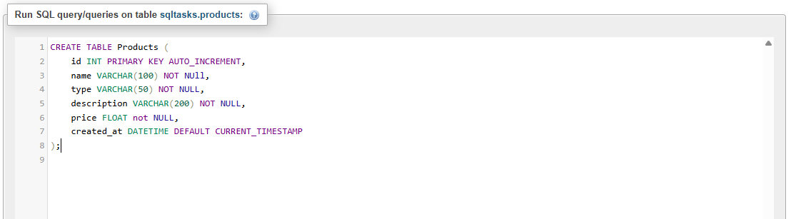
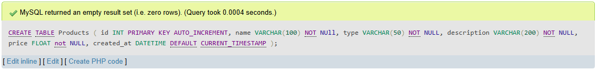
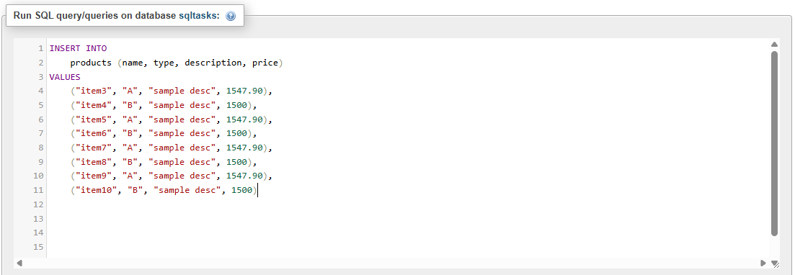
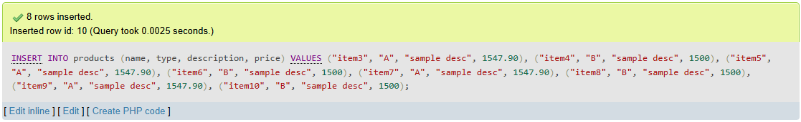
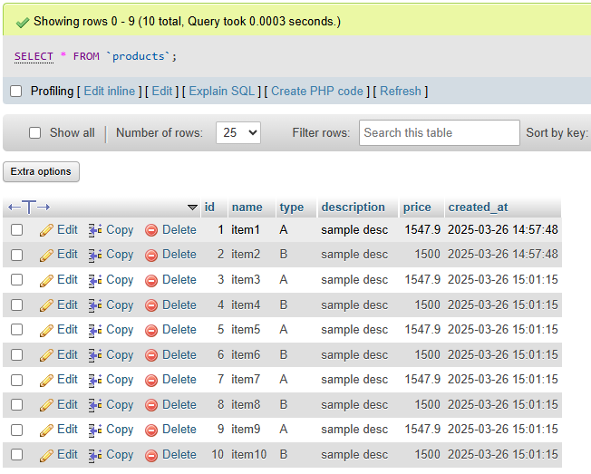

# Task 1: 🗄️ Creating and Populating Tables in SQL

### 🎯Objective :

- Set up a simple database table, insert sample data, and retrieve that data using basic SQL queries.


###  🛠️ TechStack :

- SQL (Structured Query Language)
- Relational Database Management System (MYSQL)
- SQL Queries for table creation, data insertion, and retrieval


### 💡 Features :

- **Table Creation** – Define a structured table with relevant columns and data types.   
- **Data Insertion** – Populate the table with multiple sample records.  
- **Data Retrieval** – Use `SELECT` queries to fetch and verify stored data. 

## Products Table 

### 1️⃣ Creating the Table

```
CREATE TABLE Products (
    id INT PRIMARY KEY AUTO_INCREMENT,
    name VARCHAR(100) NOT NULL,
    type VARCHAR(50) NOT NULL,
    description VARCHAR(200) NOT NULL,
    price FLOAT NOT NULL,
    created_at DATETIME DEFAULT CURRENT_TIMESTAMP
);
```



#### Output: 




### 2️⃣ Inserting Sample Data

```
INSERT INTO
    products (name, type, description, price)
VALUES
    ("item3", "A", "sample desc", 1547.90), 
    ("item4", "B", "sample desc", 1500),
    ("item5", "A", "sample desc", 1547.90),
    ("item6", "B", "sample desc", 1500), 
    ("item7", "A", "sample desc", 1547.90),
    ("item8", "B", "sample desc", 1500), 
    ("item9", "A", "sample desc", 1547.90), 
    ("item10", "B", "sample desc", 1500)
```



#### Output: 



### 3️⃣ Retrieving Data

```
SELECT * FROM products;
```
#### Output:


