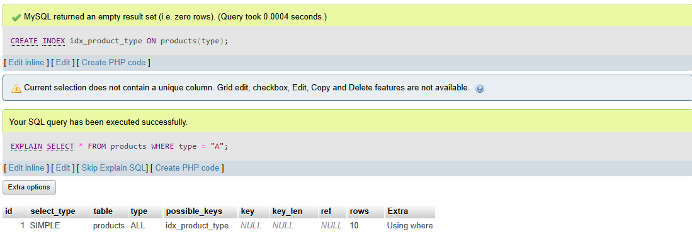

# Task 10: Comprehensive Database Design, Optimization, and Advanced Features


### 🎯Objective :

- Design a well-structured, optimized database schema and implement advanced SQL features to enhance performance, ensure data integrity, and automate key processes.


###  🛠️ TechStack :

- SQL (Structured Query Language)
- Relational Database Management System (MYSQL)
- Key-concepts:
  - Schema creation (`CREATE TABLE`, `FOREIGN KEY`)
  - Indexing (`CREATE INDEX`)
  - Transactions (`STAR TRANSACTION`, `COMMIT`, `ROLLBACK`)
  - Triggers (`CREATE TRIGGER`)
  - Views (`CREATE VIEW`)

### 💡 Features :

- `Schema Design` - A normalized database schema with multiple related tables (e.g., Products, Customers, Orders, OrderDetails). Establish primary and foreign keys to maintain data integrity. Enforce unique constraints where necessary.
- `Indexing` - Applying indexes to optimize query performance on frequently accessed columns.
- `Triggers`  - Created triggers to enforce business rules (e.g., updating inventory when an order is placed).
- `Transactions` - Used transactions to ensure that multi-step operations are atomic, and if cancelled in between data will be consistent.
- `Views` - To simplyfy data retrieval, complex query has been created as a view.

### 1️⃣ Schema Design

```
CREATE TABLE Products (
    id INT PRIMARY KEY AUTO_INCREMENT,
    name VARCHAR(100) NOT NULL,
    type VARCHAR(50) NOT NULL,
    description VARCHAR(200) NOT NULL,
    price FLOAT NOT NULL,
    created_at DATETIME DEFAULT CURRENT_TIMESTAMP
);

CREATE TABLE `customer` (
    id INT PRIMARY KEY AUTO_INCREMENT,
    name VARCHAR(100) NOT NULL,
    email VARCHAR(100) NOT NULL UNIQUE,
    number VARCHAR(100) NOT NULL,
    city VARCHAR(100) NOT NULL,
    created_at DATETIME DEFAULT CURRENT_TIMESTAMP
);

CREATE TABLE `order` (
    id INT PRIMARY KEY AUTO_INCREMENT,
    order_status VARCHAR(50) NOT NULL,
    order_value FLOAT NOT NULL,
    customer_id INT,
    FOREIGN KEY (customer_id) REFERENCES customer(id)
);

CREATE TABLE order_details (
    id INT PRIMARY KEY AUTO_INCREMENT,
    order_id INT NOT NULL,
    product_id INT NOT NULL,
    quantity INT NOT NULL,
    unit_price FLOAT NOT NULL,
    CONSTRAINT fk_order_id FOREIGN KEY (id) REFERENCES orders(order_id),
    CONSTRAINT fk_product_id FOREIGN KEY (id) REFERENCES products(product_id)
)
```


### 2️⃣ Indexing and Performance Optimization

```
EXPLAIN SELECT * FROM products WHERE type = "A";

CREATE INDEX idx_product_type ON products(type);

EXPLAIN SELECT * FROM products WHERE type = "A";
```

#### Output: 




### 3️⃣ Triggers

```
DELIMITER $$

CREATE TRIGGER updateQty
BEFORE INSERT 
ON order_details
FOR EACH ROW
BEGIN
	IF (SELECT stock from products WHERE id = NEW.product_id) >= NEW.quantity THEN
		UPDATE products
    	SET products.stock = products.stock - NEW.quantity
   	 	WHERE id = NEW.product_id;
    ELSE
    	SIGNAL SQLSTATE '45000'
        SET MESSAGE_TEXT = "Not enough stock found";
    END IF;
END$$
	
```

```
INSERT INTO 
	order_details (order_id, product_id, quantity, unit_price) 
VALUES 
	(1, 1, 1, 100);
```


#### Trigger creating error due to quantity not found


#### Inserted successfully if quantity available


### 4️⃣ Transactions for Data Consistency

```
START TRANSACTION;

INSERT INTO orders (order_status, order_value, customer_id)
VALUES ("PENDING", 1500, 2);

SET @order_id = LAST_INSERT_ID();

INSERT INTO order_details (order_id, product_id, quantity, unit_price)
VALUES (@order_id, 2, 2, 250);

COMMIT;
```


#### Transaction aborted due to error from trigger


#### Transaction commited successfully if no error


5️⃣ Views

```
CREATE VIEW order_view
AS
SELECT 
	customer.id,
	customer.name,
    customer.email,
    customer.city,
    products.name As product_name,
    `order_details`.`quantity`,
    order_details.quantity * order_details.unit_price AS total_price
FROM order_details
JOIN orders ON order_details.order_id = orders.id
JOIN products ON order_details.product_id = products.id
JOIN customer ON orders.customer_id = customer.id;
```

```
SELECT * FROM order_view;
```

