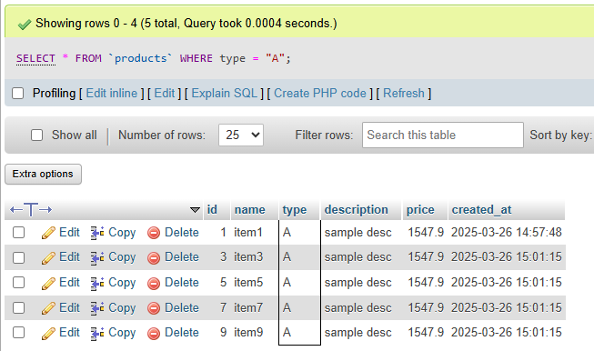
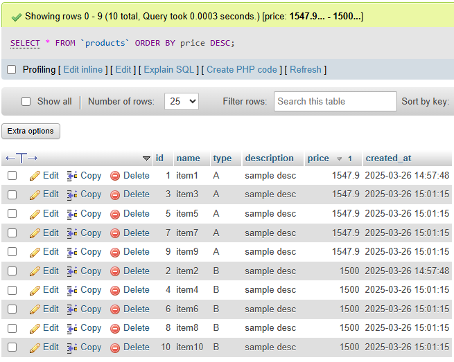
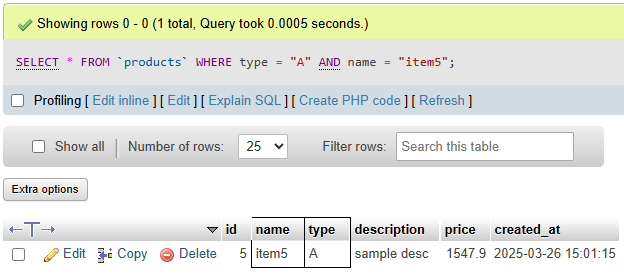
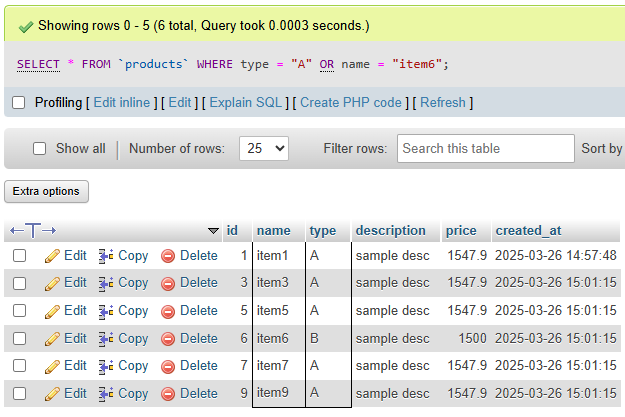

# Task 2: 📊 Basic Filtering and Sorting in SQL

### 🎯Objective :

- Write SQL queries that filter data using conditions and sort the results to organize retrieved records efficiently.


###  🛠️ TechStack :

- SQL (Structured Query Language))
- Relational Database Management System (MYSQL)
- SQL Queries using `WHERE`, `ORDER BY`, `AND`, and `OR` clauses


### 💡 Features :

- Filtering Records – Use `WHERE` to retrieve specific data based on conditions.  
- Sorting Results – Apply `ORDER BY` to arrange data in ascending or descending order.    
- Advanced Conditions – Use `AND`/`OR` operators for complex queries.  
 

## Products Table 

### 1️⃣ Filtering Data using `WHERE`

```
SELECT * FROM products WHERE type="A";
```

#### Output: 




### 2️⃣ Sorting Data using `ORDER BY`

```
SELECT * FROM products ORDER BY price DESC;
```

#### Output: 



### 3️⃣  Combining Filters with `AND` and `OR`

```
SELECT * FROM products WHERE type = "A" AND name = "item5";
```
#### Output:



```
SELECT * FROM products WHERE type = "A" OR name = "item6";
```
#### Output:


