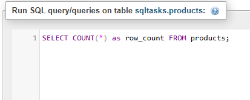
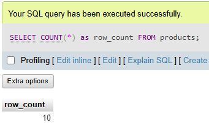
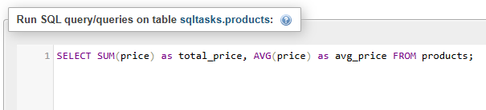
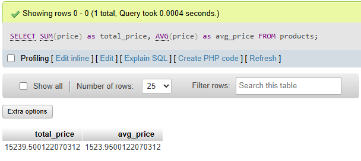
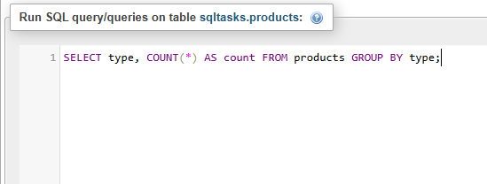
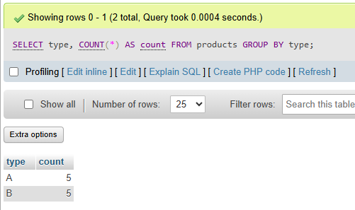
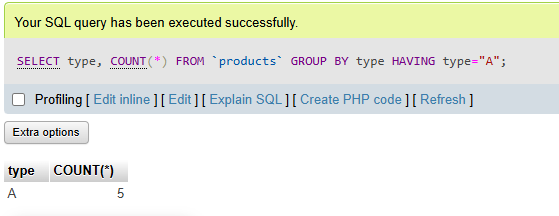
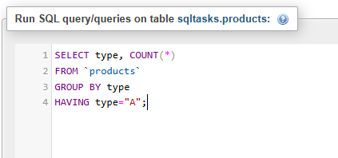

# Task 3: 📊 Simple Aggregation and Grouping in SQL

### 🎯Objective :

- Write SQL queries to summarize and analyze data using aggregate functions and grouping.


###  🛠️ TechStack :

- SQL (Structured Query Language))
- Relational Database Management System (MYSQL)
- SQL Aggregate Functions (`COUNT()`, `SUM()`, `AVG()`)
- Grouping with `GROUP BY`
- Filtering groups with `HAVING`

### 💡 Features :

- Data Aggregation – Perform calculations like sum, average, and count.  
- Grouping Data – Organize records into meaningful groups.   
- Filtering Aggregated Data – Use `HAVING` to filter grouped results.
 

## Products Table 

### 1️⃣ Counting Records using `COUNT()`, `SUM()` and `AVG()`

```
SELECT COUNT(*) AS row_count FROM products;
```


#### Output: 



```
SELECT SUM(price) as total_price, AVG(price) as avg_price FROM products;
```


#### Output: 




### 2️⃣ Grouping Data using `GROUP BY`

```
SELECT type, COUNT(*) AS count FROM products GROUP BY type;
```


#### Output:




### 3️⃣  Filtering groups using `HAVING`

```
SELECT type, COUNT(*) 
FROM `products` 
GROUP BY type 
HAVING type="A";
```


#### Output:


