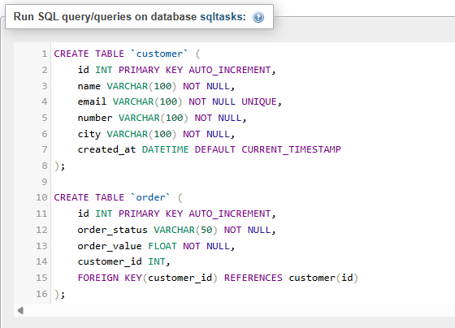
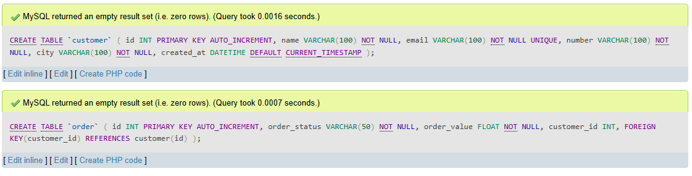
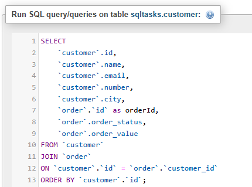
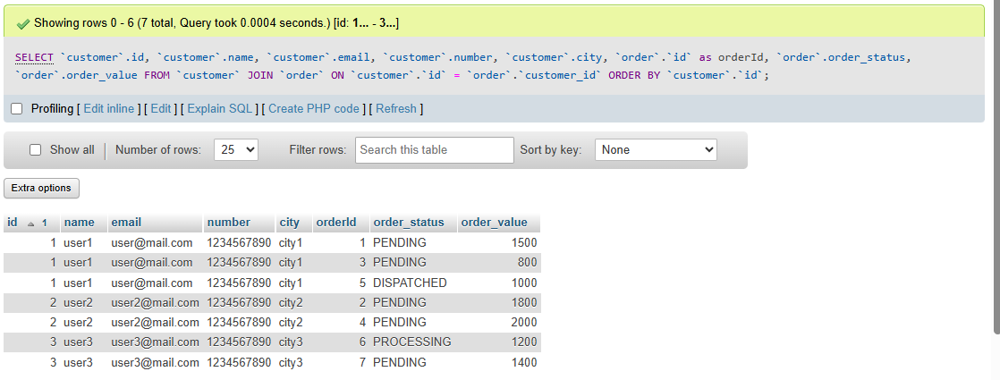
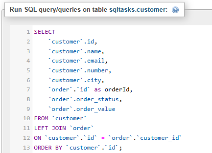
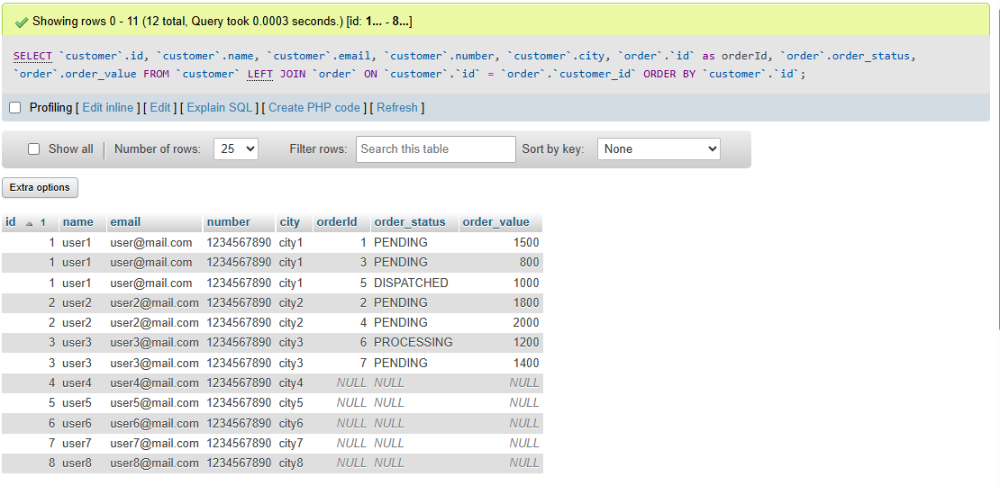

# Task 4: 🔗 Multi-Table JOINs in SQL

### 🎯Objective :

- Learn how to combine data from multiple related tables using SQL JOIN operations.

###  🛠️ TechStack :

- SQL (Structured Query Language))
- Relational Database Management System (MYSQL)
- JOIN Types: `INNER JOIN`, `LEFT JOIN`, `RIGHT JOIN`, `FULL JOIN`

### 💡 Features :

- Relational Data Handling – Link multiple tables through foreign keys.  
- JOIN Operations – Retrieve combined data from related tables.     
- Understanding Missing Data Handling – Use `LEFT JOIN` and `RIGHT JOIN` to handle unmatched records.  
 

### 1️⃣ Create and Link two tables using `FOREIGN KEY`

```
CREATE TABLE `customer` (
    id INT PRIMARY KEY AUTO_INCREMENT,
    name VARCHAR(100) NOT NULL,
    email VARCHAR(100) NOT NULL UNIQUE,
    number VARCHAR(100) NOT NULL,
    city VARCHAR(100) NOT NULL,
    created_at DATETIME DEFAULT CURRENT_TIMESTAMP
);

CREATE TABLE `order` (
    id INT PRIMARY KEY AUTO_INCREMENT,
    order_status VARCHAR(50) NOT NULL,
    order_value FLOAT NOT NULL,
    customer_id INT,
    FOREIGN KEY (customer_id) REFERENCES customer(id)
);

```


#### Output: 




### 2️⃣ INNER JOIN (JOIN) (Matching Records from Both Tables)

```
SELECT 
    `customer`.id, 
    `customer`.name, 
    `customer`.email, 
    `customer`.number, 
    `customer`.city,
    `order`.`id` as orderId,
    `order`.order_status,
    `order`.order_value
FROM `customer`
JOIN `order`
ON `customer`.`id` = `order`.`customer_id`
ORDER BY `customer`.`id`;

```


#### Output:




### 3️⃣ LEFT (OUTER) JOIN (Join all data from left table regardless of right table )

```
SELECT 
    `customer`.id, 
    `customer`.name, 
    `customer`.email, 
    `customer`.number, 
    `customer`.city,
    `order`.`id` as orderId,
    `order`.order_status,
    `order`.order_value
FROM `customer`
LEFT JOIN `order`
ON `customer`.`id` = `order`.`customer_id`
ORDER BY `customer`.`id`;
```



#### Output:



