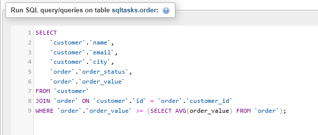
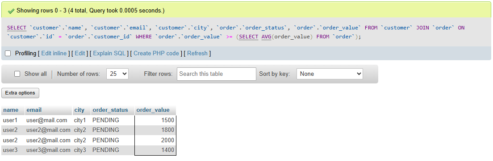
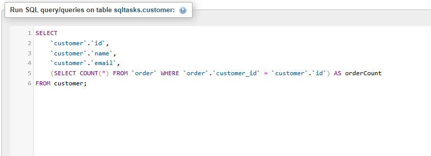
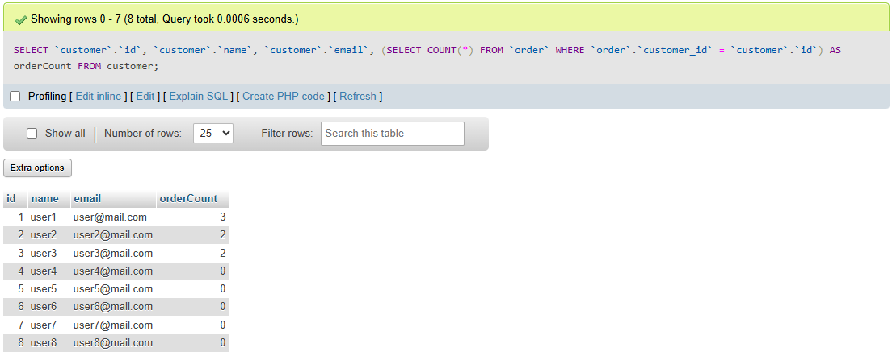
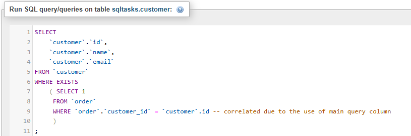
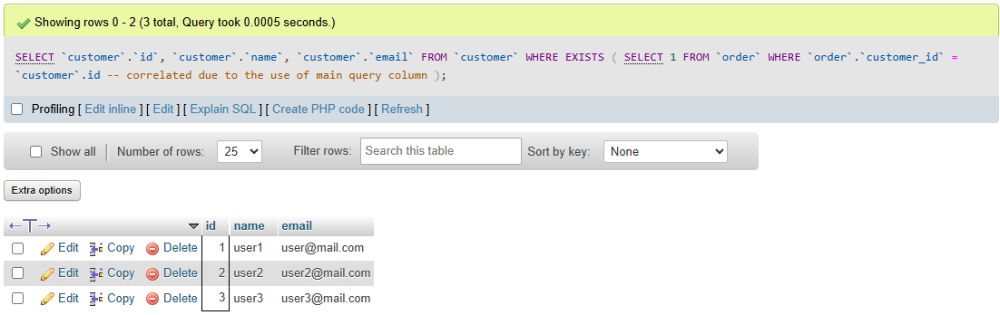

# Task 5: 🔍 Subqueries and Nested Queries in SQL

### 🎯Objective :

- Learn how to use subqueries to filter or compute values dynamically within a main SQL query.

###  🛠️ TechStack :

- SQL (Structured Query Language)
- Relational Database Management System (MYSQL)
- Subquery Types: 
  - Scalar Subqueries (returning a single value)  
  - Table Subqueries (returning multiple rows)  
  - Correlated Subqueries (dependent on the outer query)


### 💡 Features :

- Dynamic Filtering – Use subqueries inside `WHERE` clauses.
- Computed Columns – Utilize subqueries in `SELECT` statements.   
- Correlated Queries – Write queries that reference outer query data.  
 

### 1️⃣ Subquery in `WHERE` Clause  

```
SELECT 
	`customer`.`name`, 
    `customer`.`email`,
    `customer`.`city`, 
    `order`.`order_status`, 
    `order`.`order_value`
FROM `customer`
JOIN `order` ON `customer`.`id` = `order`.`customer_id`
WHERE `order`.`order_value` >= (SELECT AVG(order_value) FROM `order`);

```


#### Output: 




### 2️⃣ Subquery in SELECT Clause (Dynamic Columns)

```
SELECT 
	`customer`.`id`,
	`customer`.`name`,
    `customer`.`email`,
    (SELECT COUNT(*) FROM `order` WHERE `order`.`customer_id` = `customer`.`id`) AS orderCount
FROM customer;

```


#### Output:




### 3️⃣ Correlated Subquery

The Main difference between Correlated and Non-Correlated subqueries is that,
- In non-correlated subquery, You can independently run the subquery without main query.
- But in Correlated subquery, query is dependent on tha main query which is running it.
- Correlated subqueries are complex and need to be run for each row in the main query, whereas non-correlated queries can be ran once and use it for all rows in the main query

```
SELECT 
	`customer`.`id`,
    `customer`.`name`,
    `customer`.`email`
FROM `customer`
WHERE EXISTS 
	( SELECT 1 
     FROM `order`
     WHERE `order`.`customer_id` =  `customer`.id -- correlated due to the use of main query column
     )
;

```


#### Output:

