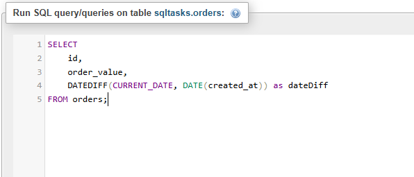
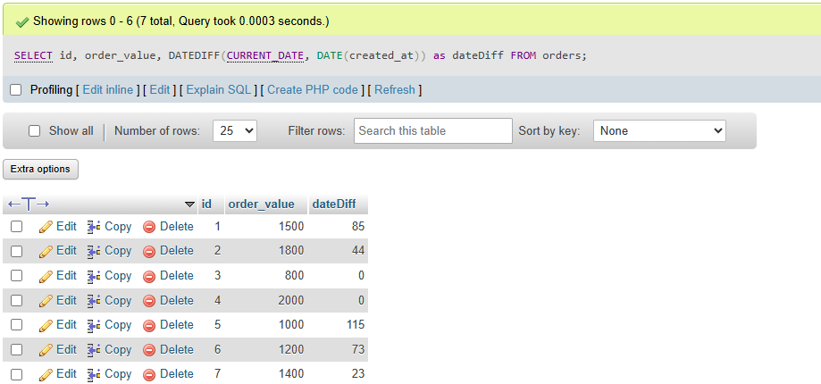
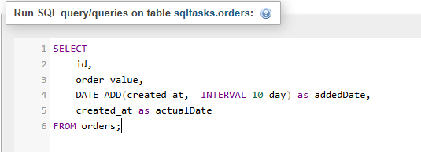
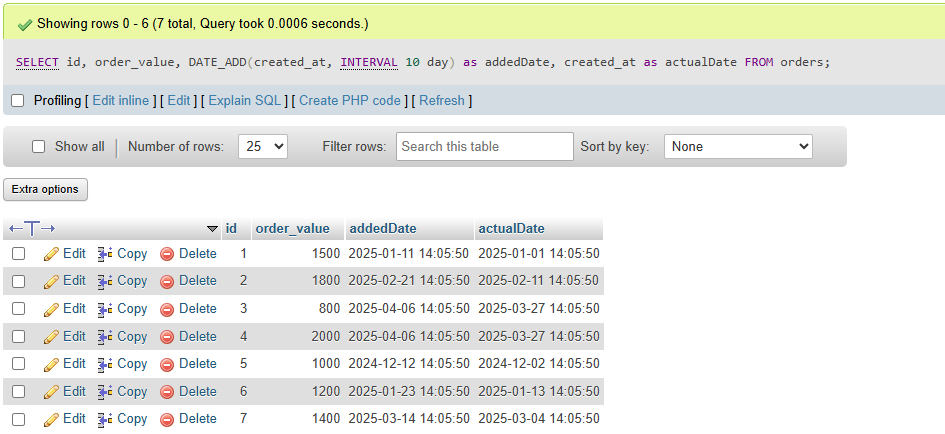
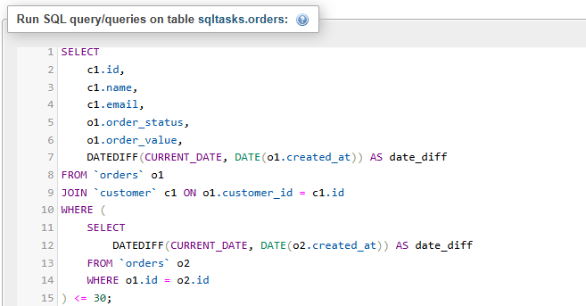
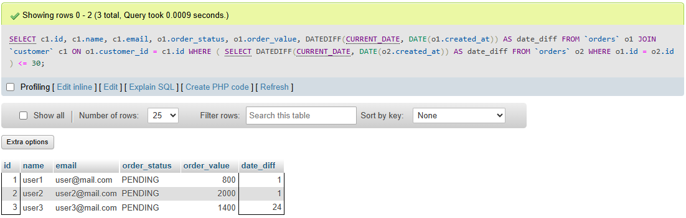
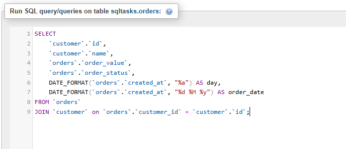
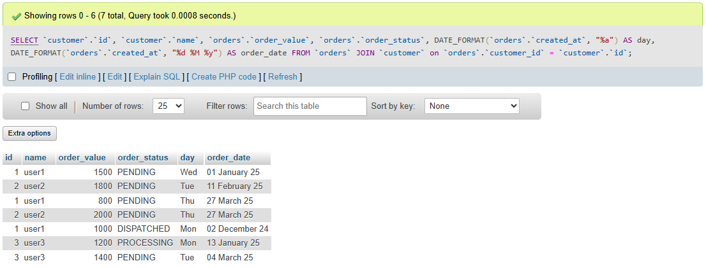

# Task 6: 🕒 Date and Time Functions in SQL

### 🎯Objective :

- Learn how to manipulate and query data using SQL date and time functions.

###  🛠️ TechStack :

- SQL (Structured Query Language)
- Relational Database Management System (MYSQL)
- Built-in Date Functions:
    - `NOW()`, `CURRENT_DATE`
    - `DATEDIFF()`, `DATEADD()`, `FORMAT()`


### 💡 Features :

- Date Manipulation - Utilized `DATEDIFF`, `DATE_ADD` functions to find difference and add certain period to date
- Filter Records - Using subquery and date fuctions like `DATEDIFF()` to filter records based on certain conditions  
- Formatting Dates – Dates are fomatted using inbuilt `DATE_FORMAT()` function
 

### 1️⃣ Get Date Difference and Add days to date 

```
SELECT 
	id, 
    order_value, 
    DATEDIFF(CURRENT_DATE, DATE(created_at)) as dateDiff 
FROM orders;

SELECT 
	id, 
    order_value, 
    DATE_ADD(created_at,  INTERVAL 10 day) as addedDate,
    created_at as actualDate
FROM orders;
```


#### Output: 





#### Output: 




### 2️⃣ Filtering records based on Dates

```
SELECT
	c1.id,
	c1.name,
    c1.email,
    o1.order_status,
    o1.order_value,
    DATEDIFF(CURRENT_DATE, DATE(o1.created_at)) AS date_diff
FROM `orders` o1
JOIN `customer` c1 ON o1.customer_id = c1.id
WHERE (
    SELECT 
    	DATEDIFF(CURRENT_DATE, DATE(o2.created_at)) AS date_diff
    FROM `orders` o2
    WHERE o1.id = o2.id
) <= 30;

```


#### Output:




### 3️⃣ Formatting Dates `DATE_FORMAT()`

By using specifiers we can format dates as per our requirements. Here are some of the specifiers,

- Year : 
    - `%y` - Year without century(25)
    - `%Y` - Year with century(2025)
- Month: 
    - `%m` - Month as number(01-12)
    - `%M` - Month as name(January-December)
    - `%b` - Month as name abbrevation (Jan-Dec)
- Day : 
    - `%d` - Day of the month(01-31)
    - `%e` - Day of the month(1-31)
    - `%j` - Day of the year(01-366)

Still there are lot more specifiers.Explore it !!

```
SELECT 
	`customer`.`id`,
    `customer`.`name`,
    `orders`.`order_value`,
    `orders`.`order_status`,
    DATE_FORMAT(`orders`.`created_at`, "a") AS day,
	DATE_FORMAT(`orders`.`created_at`, "%d %M %y") AS order_date
FROM `orders`
JOIN `customer` on `orders`.`customer_id` = `customer`.`id`;

```


#### Output:


