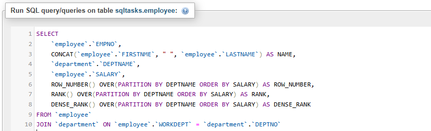
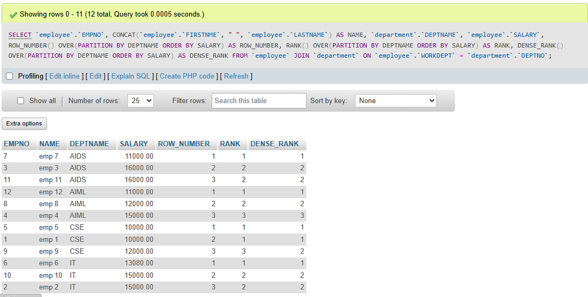
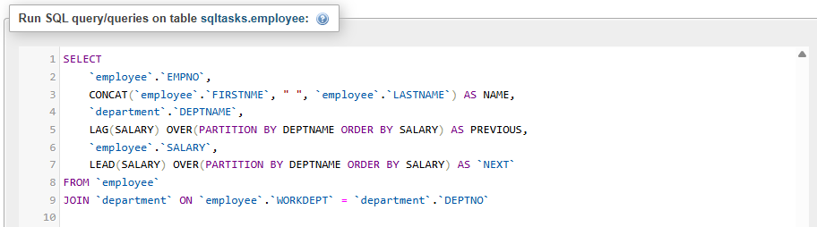
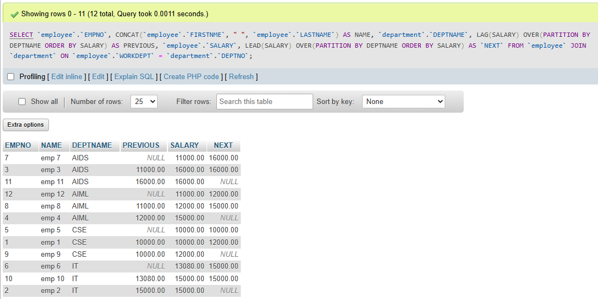

# Task 7: 🏆 Window Functions and Ranking in SQL

### 🎯Objective :

- Learn how to use **window functions** to perform calculations across sets of rows while preserving individual row data.


###  🛠️ TechStack :

- SQL (Structured Query Language)
- Relational Database Management System (MYSQL)
- Built-in Date Functions:
  - `ROW_NUMBER()`, `RANK()`, `DENSE_RANK()`
  - `LEAD()`, `LAG()`
  - `SUM() OVER()`, `AVG() OVER()`, `COUNT() OVER()`
  - `PARTITION BY`, `ORDER BY`

### 💡 Features :

- Window Functions - Usage of window functions like `ROW_NUMBER()`, `RANK()` and `DENSE_RANK()` to rank rows based on some conditions.
- `PARTITION BY`, `OVER` clauses to use window functions based on some grouping and order respectively
- `LAG()`,  `LEAD()` window functions to get adjacent rows previous or next values for comparison related functions.
 

### 1️⃣ Usage of `ROW_NUMBERS()`, `RANK()` and `DENSE_RANK()`

- `ROW_NUMBER()` will assign unique number to all rows mentions in the window starting from 1.
- `RANK()` will assign ranks starting from 1, if any row has duplicates then it will assign same rank, and skip next number.
- `DENSE_RANK()` will assign ranks starting from 1, if any row has duplicates then it will assign same rank and will not skip next number like `RANK()`

```
SELECT 
	`employee`.`EMPNO`,
	CONCAT(`employee`.`FIRSTNME`, " ", `employee`.`LASTNAME`) AS NAME,
    `department`.`DEPTNAME`,
    `employee`.`SALARY`,
    ROW_NUMBER() OVER(PARTITION BY DEPTNAME ORDER BY SALARY) AS ROW_NUMBER,
    RANK() OVER(PARTITION BY DEPTNAME ORDER BY SALARY) AS RANK,
    DENSE_RANK() OVER(PARTITION BY DEPTNAME ORDER BY SALARY) AS DENSE_RANK,
    LAG(SALARY) OVER(PARTITION BY DEPTNAME) AS LAG
FROM `employee`
JOIN `department` ON `employee`.`WORKDEPT` = `department`.`DEPTNO`
```



#### Output: 




### 2️⃣ Usage of `PARTITION BY` and `OVER`

- `PARTITION BY` clause is used to group windows based on the column specifed 
- `OVER` clause is used to order the rows in the window specifed

```
SELECT 
	`employee`.`EMPNO`,
	CONCAT(`employee`.`FIRSTNME`, " ", `employee`.`LASTNAME`) AS NAME,
    `department`.`DEPTNAME`,
    LAG(SALARY) OVER(ORDER BY SALARY) AS PREVIOUS,
    `employee`.`SALARY`,
	LEAD(SALARY) OVER(ORDER BY SALARY) AS NEXT
FROM `employee`
JOIN `department` ON `employee`.`WORKDEPT` = `department`.`DEPTNO`
```


#### Output:


### 3️⃣ Usage of `LAG()` and `LEAD()`

```
SELECT 
	`employee`.`EMPNO`,
	CONCAT(`employee`.`FIRSTNME`, " ", `employee`.`LASTNAME`) AS NAME,
    `department`.`DEPTNAME`,
    LAG(SALARY) OVER(PARTITION BY DEPTNAME ORDER BY SALARY) AS PREVIOUS,
    `employee`.`SALARY`,
	LEAD(SALARY) OVER(PARTITION BY DEPTNAME ORDER BY SALARY) AS `NEXT`
FROM `employee`
JOIN `department` ON `employee`.`WORKDEPT` = `department`.`DEPTNO`
```


#### Output:

