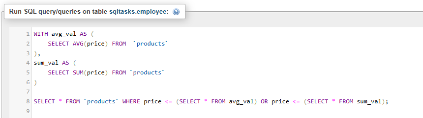
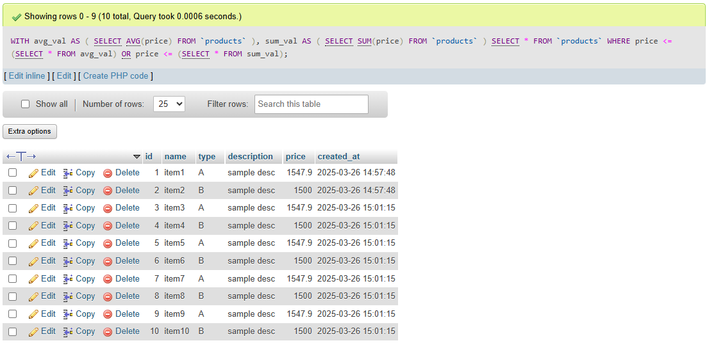
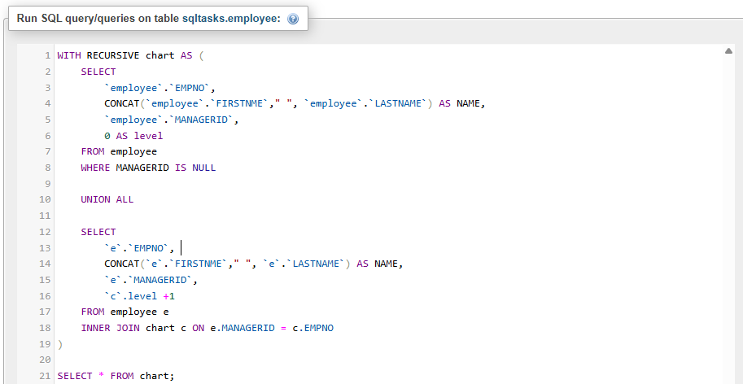
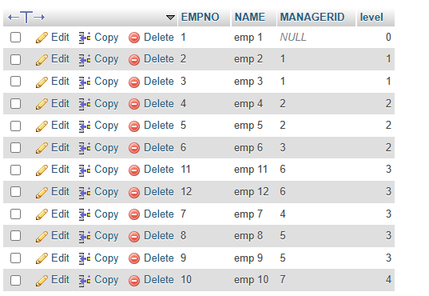

# Task 8: 📌 Common Table Expressions (CTEs) & Recursive Queries in SQL


### 🎯Objective :

- Learn how to use **Common Table Expressions (CTEs)** to simplify complex queries and process **hierarchical data** with **recursive queries**.


###  🛠️ TechStack :

- SQL (Structured Query Language)
- Relational Database Management System (MYSQL)
- Key-concepts:
  - CTEs (`WITH` clause)
  - Non-Recursive CTEs
  - Recursive CTEs for hierarchical data

### 💡 Features :

- CTE - Useful to breakdown complex queries in simple queries.
- CTE is a temproary resulted table which can be used for further main query to reduce complexity
- Non-recursive CTE's - Single time executed and result will be used for further execution
- Resusive CTE's - Similar to loops until previous query returns empty result set, this will execute. 
 

### 1️⃣ Non-Recursive CTE: Breaking Down Complex Queries

- `WITH` clause will define start of CTE's
- `avg_val` will calculate average price from products
- Then it can be used in the main query.

```
WITH avg_val AS (
    SELECT AVG(price) FROM 	`products`
),
sum_val AS (
    SELECT SUM(price) FROM `products`
)

SELECT * FROM `products` WHERE price <= (SELECT * FROM avg_val) OR price <= (SELECT * FROM sum_val);

```



#### Output: 




### 2️⃣ Recursive CTE: Handling Hierarchical Data

- `WITH RECURSIVE` clause will define start of recursive CTE's.
- `Anchor member` - First select query is known as Anchor member, which will define first set of results based on which successive itertaion will be processed.
- `Recursive member` - From last iteration result this recursion set will be selected. Recursion will stop when previous set returns empty set.
- To avoid infinite loops proper `WHERE` condition should be given.

```
WITH RECURSIVE chart AS (
    SELECT  -- Anchor member
    	`employee`.`EMPNO`, 
    	CONCAT(`employee`.`FIRSTNME`," ", `employee`.`LASTNAME`) AS NAME, 
    	`employee`.`MANAGERID`,
    	0 AS level 
    FROM employee
    WHERE MANAGERID IS NULL
    
    UNION ALL
    
    SELECT  -- Recursive member
    	`e`.`EMPNO`, 
    	CONCAT(`e`.`FIRSTNME`," ", `e`.`LASTNAME`) AS NAME, 
    	`e`.`MANAGERID`,
    	`c`.level +1
    FROM employee e
    INNER JOIN chart c ON e.MANAGERID = c.EMPNO
)

SELECT * FROM chart;

```



#### Output:



