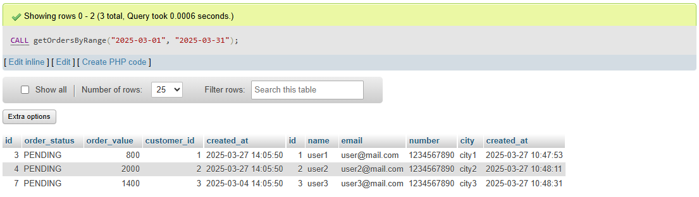
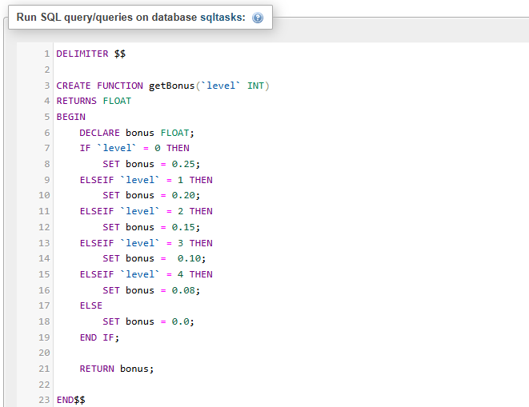

# Task 9: 📌 Stored Procedures & User-Defined Functions in SQL


### 🎯Objective :

- Learn how to encapsulate business logic using Stored Procedures and User-Defined Functions (UDFs) in SQL.


###  🛠️ TechStack :

- SQL (Structured Query Language)
- Relational Database Management System (MYSQL)
- Key-concepts:
  - Stored Procedures (`CREATE PROCEDURE`)
  - User-Defined Functions (UDFs) (`CREATE FUNCTION`)

### 💡 Features :

- `Stored Procedure` - A precompiled SQL script that accepts parameters and performs a series of operations.
- `User-Defined Functions (UDFs)` - Returns a value based on input parameters. It can be Scalar (returns a single value) or Table-Valued (returns a table).
 

### 1️⃣ Stored Procedure

- With `CREATE PROCEDURE` we can define procedures with or without parameters to do something like select, insert, update, etc..,
- `CALL Procedure_name(param1, param2...)` will call the stored procedure.  

```
DELIMITER $$

CREATE PROCEDURE getOrdersByRange (
    IN start_date DATETIME,
    IN end_date DATETIME
)
BEGIN 
	SELECT
    	*
    FROM
    	`orders`
    JOIN
    	`customer` on `orders`.`customer_id` =`customer`.`id`
     WHERE `orders`.`created_at` BETWEEN start_date AND end_date;
END$$

-- Function call

CALL getOrdersByRange("2025-03-01", "2025-03-31");

```


#### Output: 





### 2️⃣ User-Defined Functions (UDFs)

- Using `CREATE FUNCTION` we can define our own functions like AVG(), MAX(), MIN()
- Will either return a Scalar value (single value) or Table value(in form of table)

```
DELIMITER $$
CREATE FUNCTION getBonus(`level` INT)
RETURNS FLOAT
BEGIN
	DECLARE bonus FLOAT;
	IF `level` = 0 THEN
    	SET bonus = 0.25;
    ELSEIF `level` = 1 THEN
    	SET bonus = 0.20;
    ELSEIF `level` = 2 THEN
    	SET bonus = 0.15;
    ELSEIF `level` = 3 THEN
    	SET bonus =  0.10;
    ELSEIF `level` = 4 THEN
    	SET bonus = 0.08;
    ELSE
    	SET bonus = 0.0;
    END IF;
    
    RETURN bonus;
END$$

 SELECT 
 	chart.EMPNO,
 	CONCAT(chart.FIRSTNME,chart.LASTNAME) AS NAME,
    chart.SALARY,
    chart.level AS LEVEL,
    CONCAT(getBonus(chart.level), "%") AS BONUS_PER,
    ROUND(getBonus(chart.level) * chart.SALARY) AS BONUS_AMT 
FROM chart; -- chart is my recursive CTE

    
```




#### Output:


